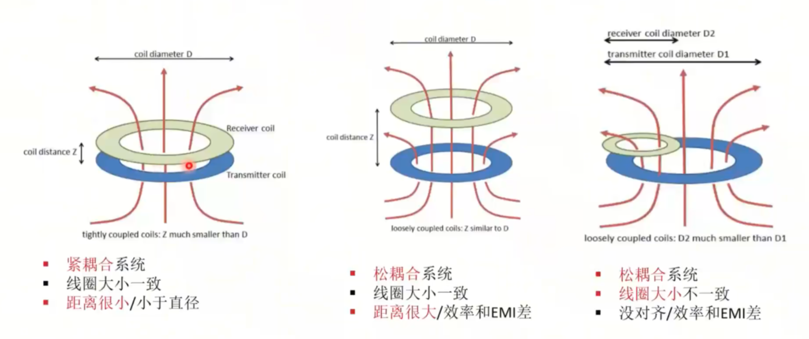

# 学习文档-[Microchip微芯](https://space.bilibili.com/40916908/?spm_id_from=333.788.upinfo.detail.click)

## 概念

### 耦合系统

分类

### 电路组成

### 数据通信

数据通信的格式好像都是这种比较多，通过周期内电平是否反转来分辨，然后像串口一样有校验位、起始位、停止位。

### 工作流程

## 线圈设计

主要讲协议的线圈设计，意义不大

## FOD异物检测

基本逻辑：测量谐振特性（品质因数Q等）来发现异物

途径：频率扫描

## NFC

同样意义不大

---

以下为第二节内容

## 通信物理层

### ASK（调幅）

和上一节讲的好像差不多

### FSK（调频）

## 通信协议层

以Qi协议为例

