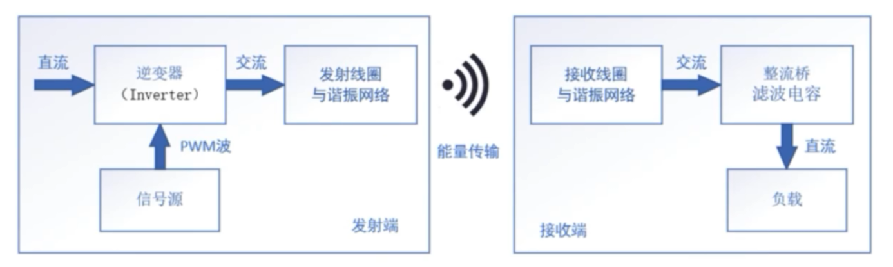
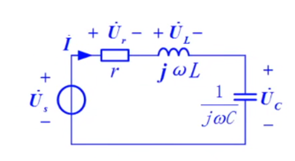
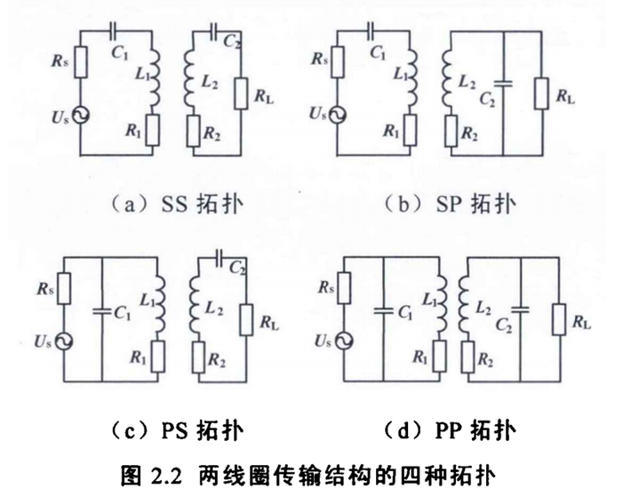
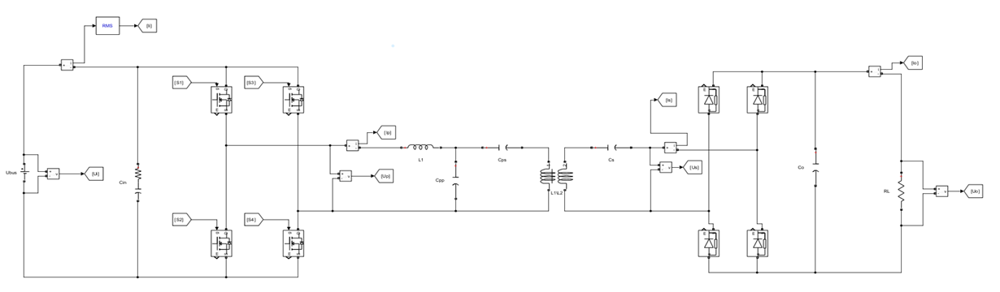
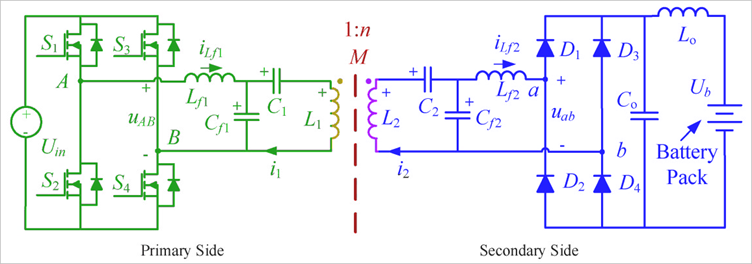

# 学习笔记-尚知物理

以下为第一节内容。

## 无线充电原理

### 无线充电类型

- 原始：感应式
  缺点：松耦合，效率低
- 当前：磁共振
  优点：利用元件共振，耦合紧密，效率高

### RLC串联谐振

共振频率：$f=\frac{1}{2\pi\sqrt{LC}}$

谐振有并联（Parallel-P）和串联（Series-S）两种类型。

SS：恒流特性，适合用于电池/电容充电
SP：恒压特性

SS、SP型：空载问题，原边是串联谐振所以内阻很小，如果没有副边负载的话电流会很大，需要做匹配检测才能开启
PS、PP型：不合理，受负载影响大

### LCC-S型（重点）

原边侧由一个电感（L1）、两个电容构成一个T型网络给原边线圈补偿，故称LCC，复变是LC串联，也就是S型。

特点：输出恒压

### LCC-LCC型

特点：输出恒流

### LCC网络参数计算

卓晴和尚知物理各有一套计算方法。

