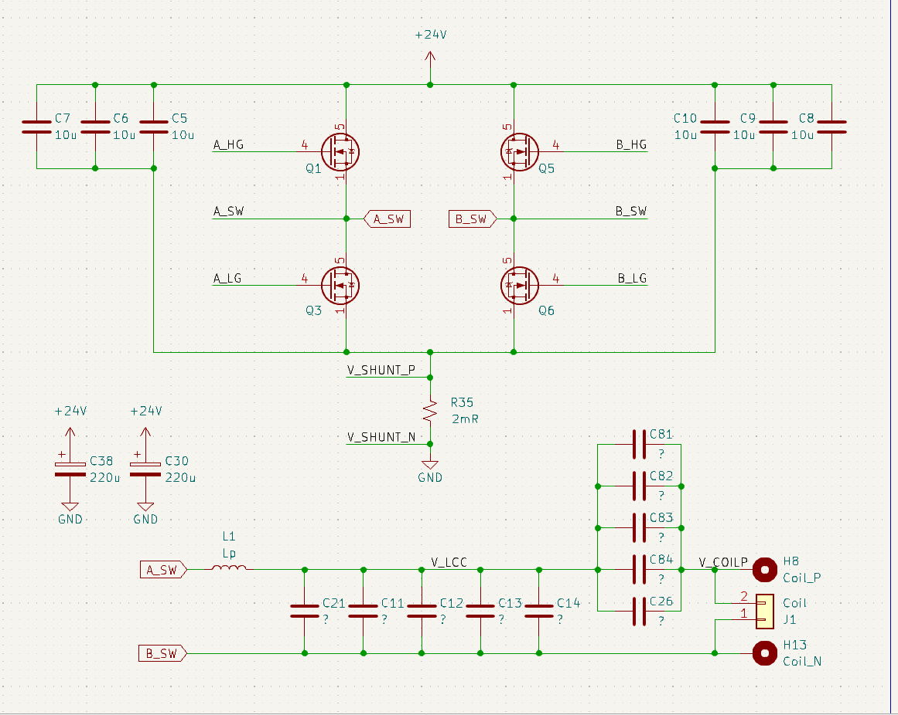

# 无线充电工程日记

## Intro

此处实时记录无线充电研发过程。

## 参考文献

[港科大无线充电开源](https://github.com/hkustenterprize/RM2025-PowerControlBoard-WirelessCharging)

[北理工无线充电开源](https://bbs.robomaster.com/article/716312?source=4)

[南理工无线充电开源](https://bbs.robomaster.com/article/716246?source=4)

[华南师范无线充电仿真](https://bbs.robomaster.com/article/557769?source=4)

[官方圆桌充电分享](https://bbs.robomaster.com/article/379476?source=4)

## 2025

### 9.17

开工！

计划先从港科大等开源无线充电方案学起，如有必要 进行建模调试，再进行硬件设计。

### 9.18

初步想法是以港科大无线充电为基础，但是超电和无线充接收端先不集成在一起（超电正式队员在学习和迭代不好耦合），二者可以用CAN通讯下；无线充发射端没什么好改动的，先抄开源实现了再说。

### 10.2

抽空看完了港科大的无线充开源，功率拓扑方面他们使用了全桥逆变，全桥逆变接了LCC谐振电路；采样采的是全桥的低端电流和母线电压，比较好玩的是用了STM32G4的内置运放，这个我没玩过。接收端是LC

无线通信是接收端发送信息，发射端接受信息，使用的是ASK。通信协议是自己定义的。

学习[【无线充电基础知识及应用培训教程】](https://www.bilibili.com/video/BV1eU9cYqEzW/?share_source=copy_web&vd_source=34dd435d3d651e8a3a60eacd5873aed9) 中。

### 10.4

看完[【无线充电基础知识及应用培训教程】](https://www.bilibili.com/video/BV1eU9cYqEzW/?share_source=copy_web&vd_source=34dd435d3d651e8a3a60eacd5873aed9) 了，意义不大=(，这套视频都是基于Qi等成品协议的，讲的也都是这些协议具体的细节，而不是电路原理或者如何实现这些。

看了北理工的无线充开源，北理工的功率拓扑是发射端使用逆变全桥+LC串联，接收端使用LCC。主控使用的是F334.线圈检测不是港科大是ASK载波通信方案，而是使用异物检测，来排除异物。这个方法技术难度可能相对低一点。

学习[尚知物理的视频](https://www.bilibili.com/video/BV1rirsYSEgm)中。

